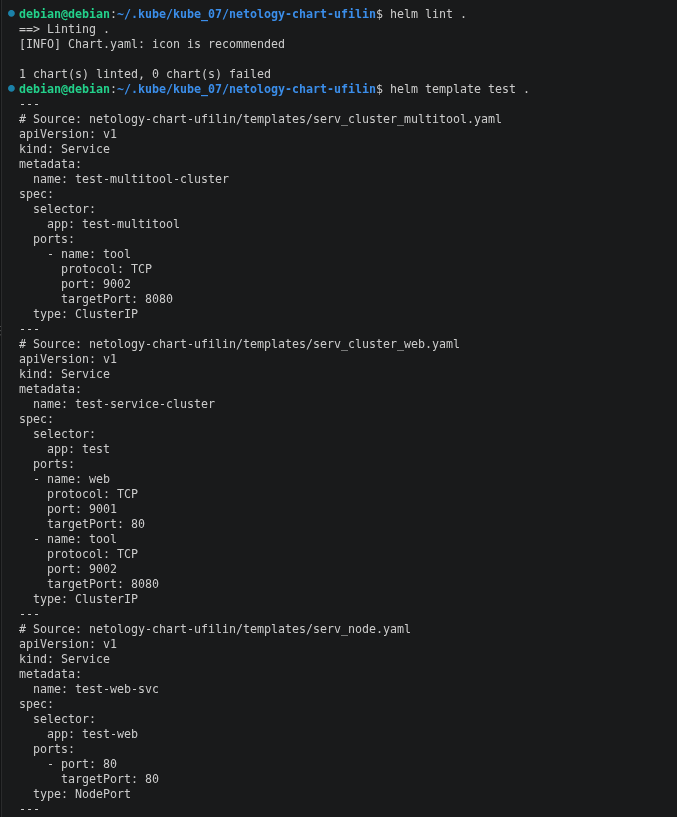
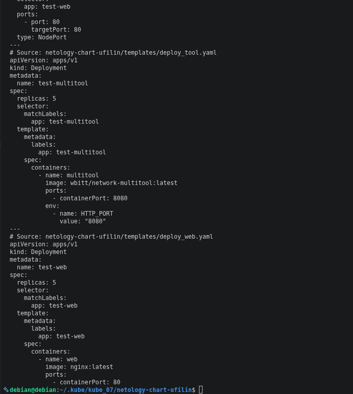
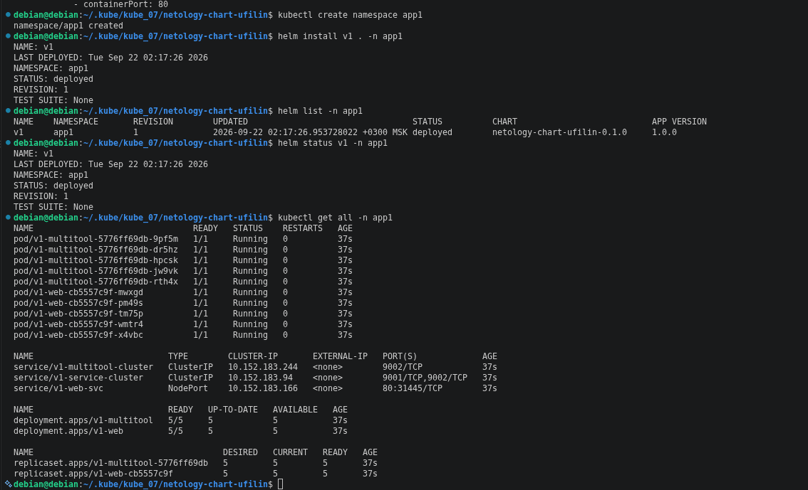
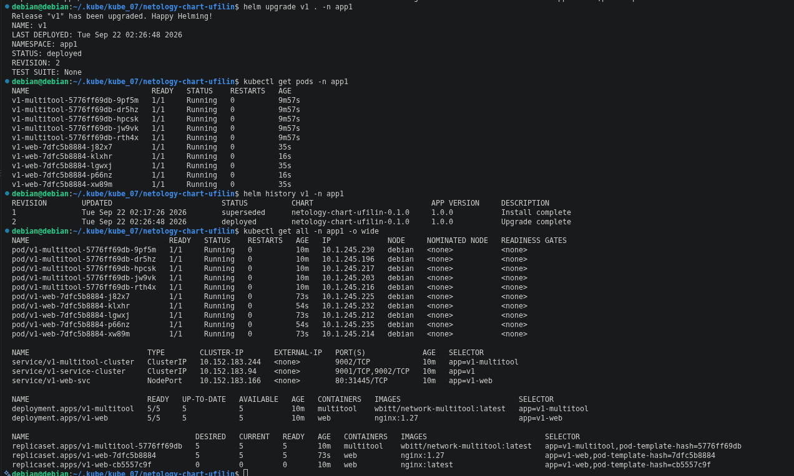
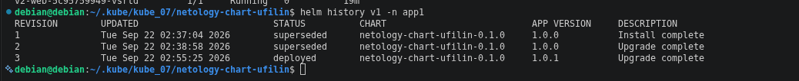
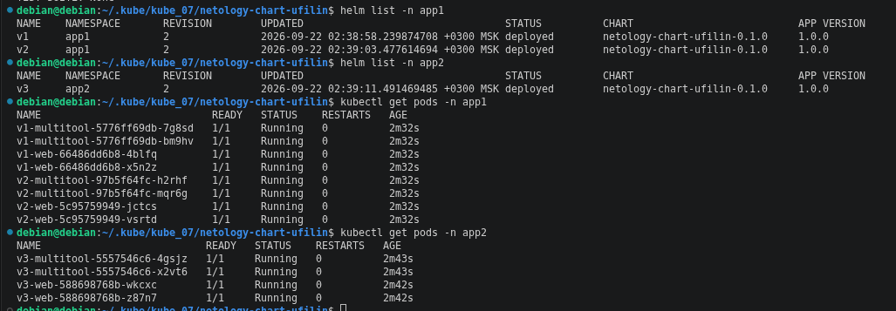

# kube_07

### Манифесты:
  
**[deploy_multitool.yaml](https://github.com/ufilin/kube_07/blob/main/netology-chart-ufilin/templates/deploy_multitool.yaml)**  
**[deploy_web.yaml](https://github.com/ufilin/kube_07/blob/main/netology-chart-ufilin/templates/deploy_web.yaml)**  
**[serv_cluster_multitool.yaml](https://github.com/ufilin/kube_07/blob/main/netology-chart-ufilin/templates/serv_cluster_multitool.yaml)**  
**[serv_cluster_web.yaml](https://github.com/ufilin/kube_07/blob/main/netology-chart-ufilin/templates/serv_cluster_web.yaml)**  
**[serv_node.yaml](https://github.com/ufilin/kube_07/blob/main/netology-chart-ufilin/templates/serv_node.yaml)**  
**[Chart.yaml](https://github.com/ufilin/kube_07/blob/main/netology-chart-ufilin/Chart.yaml)**  
**[values.yaml](https://github.com/ufilin/kube_07/blob/main/netology-chart-ufilin/values.yaml)**    

  
## Задание 1: Подготовить Helm-чарт для приложения  
  
### Скриншот вывода curl  
  

  

  

  

После изменения версии образа контейнера nginx:

  

Потом перечитал задание и подумал что нужно было ещё обновить версию приложения в Chart:

  

## Задание 2: Запустить две версии в разных неймспейсах
  
### Скриншот вывода curl

  

